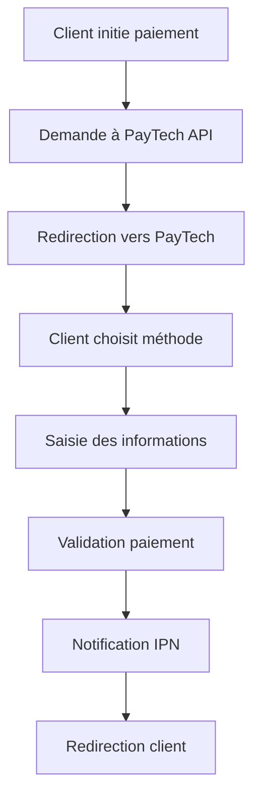

# Vue d'ensemble des paiements

Guide complet sur les paiements avec PayTech.

## 🎯 Introduction

PayTech offre une solution complète de paiement en ligne qui permet d'accepter des paiements via :
- **Mobile Money** : Orange Money, Tigo Cash, Wave
- **Cartes bancaires** : Visa, Mastercard
- **Portefeuilles électroniques** : Emoney

## 🔄 Flux de paiement

### 1. Processus standard



### 2. Étapes détaillées

#### Étape 1 : Initialisation
```javascript
// Créer une demande de paiement
const paymentData = {
    item_name: "Achat produit",
    item_price: 10000,
    currency: "xof",
    ref_command: "CMD_" + Date.now(),
    success_url: "https://monsite.com/success",
    cancel_url: "https://monsite.com/cancel",
    ipn_url: "https://monsite.com/ipn"
};
```

#### Étape 2 : Redirection
```javascript
// Rediriger vers PayTech
window.location.href = response.redirect_url;
```

#### Étape 3 : Traitement
Le client est redirigé vers PayTech où il :
1. Choisit sa méthode de paiement
2. Saisit ses informations
3. Confirme le paiement

#### Étape 4 : Retour
Selon le résultat :
- **Succès** : Redirection vers `success_url`
- **Annulation** : Redirection vers `cancel_url`
- **Notification** : IPN envoyé vers `ipn_url`

## 💳 Méthodes de paiement

### Orange Money
- **Pays** : Sénégal, Mali, Burkina Faso, Côte d'Ivoire
- **Devise** : XOF principalement
- **Limites** : 500 XOF - 2,000,000 XOF
- **Frais** : Variables selon le montant

### Tigo Cash
- **Pays** : Sénégal
- **Devise** : XOF
- **Limites** : 100 XOF - 1,000,000 XOF
- **Frais** : 1-3% selon le montant

### Wave
- **Pays** : Sénégal, Côte d'Ivoire
- **Devise** : XOF
- **Limites** : 100 XOF - 1,500,000 XOF
- **Frais** : Gratuit pour l'utilisateur

### Cartes bancaires
- **Types** : Visa, Mastercard
- **Devise** : XOF, EUR, USD, CAD, GBP, MAD
- **Limites** : Selon la banque émettrice
- **Frais** : 2.9% + frais fixes

## 🌍 Devises supportées

| Devise | Code | Symbole | Pays principaux |
|--------|------|---------|-----------------|
| Franc CFA | XOF | CFA | Sénégal, Mali, Burkina, Côte d'Ivoire |
| Euro | EUR | € | France, Europe |
| Dollar US | USD | $ | États-Unis |
| Dollar Canadien | CAD | C$ | Canada |
| Livre Sterling | GBP | £ | Royaume-Uni |
| Dirham Marocain | MAD | DH | Maroc |

### Conversion automatique
```javascript
// PayTech gère automatiquement la conversion
const payment = {
    item_price: 100, // EUR
    currency: "eur",
    // Sera converti en XOF pour Orange Money
};
```

## 🔒 Sécurité

### Authentification
- **API Key** : Clé publique pour identifier le marchand
- **API Secret** : Clé secrète pour signer les requêtes
- **HMAC SHA256** : Signature des données sensibles

### Validation des paiements
```javascript
// Vérifier la signature HMAC
function validatePayment(data, signature, secretKey) {
    const message = `${data.amount}|${data.ref_command}|${data.api_key}`;
    const expectedSignature = crypto
        .createHmac('sha256', secretKey)
        .update(message)
        .digest('hex');
    
    return signature === expectedSignature;
}
```

### Bonnes pratiques
1. **HTTPS obligatoire** pour toutes les communications
2. **Validation côté serveur** de tous les paiements
3. **Stockage sécurisé** des clés API
4. **Logs d'audit** pour traçabilité
5. **Timeouts appropriés** pour les requêtes

## 📱 Intégration mobile

### URLs spéciales
Pour les applications mobiles, utilisez :
```javascript
const MOBILE_SUCCESS_URL = "https://paytech.sn/mobile/success";
const MOBILE_CANCEL_URL = "https://paytech.sn/mobile/cancel";
```

### Deep linking
```javascript
// Configuration pour applications natives
const mobileConfig = {
    success_url: "monapp://payment/success",
    cancel_url: "monapp://payment/cancel",
    // PayTech détecte automatiquement les deep links
};
```

### Préfillage mobile
```javascript
// Préfiller les informations utilisateur
const mobilePayment = {
    // ... données de base
    target_payment: "Orange Money", // Méthode unique
    // Paramètres de redirection avec préfillage
    redirect_params: {
        pn: "+221701234567", // Numéro complet
        nn: "701234567",     // Numéro national
        fn: "John Doe",      // Nom complet
        tp: "Orange Money",  // Méthode ciblée
        nac: 1              // Auto-submit
    }
};
```

## 🔔 Notifications IPN

### Configuration
```javascript
const ipnConfig = {
    ipn_url: "https://monsite.com/webhook/paytech",
    // L'URL doit être accessible publiquement
    // Format: POST application/x-www-form-urlencoded
};
```

### Traitement
```php
<?php
// Traiter les notifications IPN
if ($_SERVER['REQUEST_METHOD'] === 'POST') {
    $ipnData = $_POST;
    
    // Valider la signature
    if (validateIPN($ipnData)) {
        // Traiter le paiement
        processPayment($ipnData);
    }
}
?>
```

## 📊 Gestion des états

### États de transaction

| État | Description | Action |
|------|-------------|--------|
| `pending` | En attente | Attendre confirmation |
| `processing` | En cours | Traitement en cours |
| `completed` | Terminé | Paiement réussi |
| `failed` | Échoué | Paiement échoué |
| `cancelled` | Annulé | Annulé par l'utilisateur |
| `refunded` | Remboursé | Remboursement effectué |

### Vérification de statut
```javascript
// Vérifier le statut d'une transaction
async function checkPaymentStatus(token) {
    const response = await fetch(`https://paytech.sn/api/payment/check/${token}`, {
        headers: {
            'API_KEY': 'votre_api_key',
            'API_SECRET': 'votre_secret_key'
        }
    });
    
    return await response.json();
}
```

## 🛠️ Outils de développement

### Mode test
- **Environnement** : `test`
- **Cartes de test** : Disponibles
- **Numéros mobiles** : Simulés
- **Pas de frais** : Transactions gratuites

### Cartes de test
```
Visa Success: 4111111111111111
Visa Decline: 4000000000000002
Mastercard Success: 5555555555554444
Mastercard Decline: 5000000000000009

Expiry: 12/25
CVV: 123
```

### Numéros de test
```
Orange Money: +221701234567
Tigo Cash: +221761234567
Wave: +221781234567
```

## 📈 Optimisation

### Performance
- **Cache** : Mettre en cache les réponses API
- **Async** : Traiter les IPN de manière asynchrone
- **Retry** : Implémenter une logique de retry
- **Monitoring** : Surveiller les temps de réponse

### Conversion
- **UX** : Interface utilisateur optimisée
- **Mobile** : Expérience mobile fluide
- **Localisation** : Adapter selon le pays
- **Méthodes** : Proposer les bonnes méthodes

### Exemple d'optimisation
```javascript
// Détecter le pays et proposer les bonnes méthodes
function getAvailablePaymentMethods(country) {
    const methods = {
        'SN': ['Orange Money', 'Tigo Cash', 'Wave', 'Carte Bancaire'],
        'ML': ['Orange Money', 'Carte Bancaire'],
        'BF': ['Orange Money', 'Carte Bancaire'],
        'CI': ['Orange Money', 'Wave', 'Carte Bancaire']
    };
    
    return methods[country] || ['Carte Bancaire'];
}
```

## 🔍 Débogage

### Logs recommandés
```javascript
// Logger les étapes importantes
console.log('1. Initialisation paiement:', paymentData);
console.log('2. Réponse PayTech:', response);
console.log('3. Redirection vers:', redirectUrl);
console.log('4. IPN reçu:', ipnData);
console.log('5. Validation:', isValid);
```

### Erreurs courantes
1. **Clés API incorrectes** : Vérifier l'environnement
2. **URLs invalides** : Vérifier HTTPS et accessibilité
3. **Signature incorrecte** : Vérifier l'algorithme HMAC
4. **Timeout** : Augmenter les délais d'attente
5. **Devise non supportée** : Vérifier la liste des devises

## 📞 Support

### Ressources
- **Documentation** : [https://docs.paytech.sn](https://docs.paytech.sn)
- **Support** : [support@paytech.sn](mailto:support@paytech.sn)
- **Status** : [https://status.paytech.sn](https://status.paytech.sn)

### Informations à fournir
- ID de transaction
- Logs d'erreur
- Configuration utilisée
- Environnement (test/prod)
- Méthode de paiement

